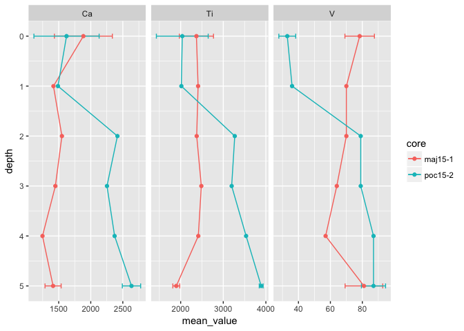

<!-- README.md is generated from README.Rmd. Please edit that file -->
paleoxrf
========

The goal of paleoxrf is to make manipulating XRF data from cores easy!

Installation
------------

The paleoxrf package is intended for use with the [tidyverse](https://www.tidyverse.org/), which should also be installed prior to using paleoxrf.

``` r
# install.packages("tidyverse")
# install.packages("devtools")
devtools::install_github("paleolimbot/paleoxrf")
```

If all is well, you should be able to load the two packages:

``` r
library(paleoxrf)
library(tidyverse)
#> Loading tidyverse: ggplot2
#> Loading tidyverse: tibble
#> Loading tidyverse: tidyr
#> Loading tidyverse: readr
#> Loading tidyverse: purrr
#> Loading tidyverse: dplyr
#> Conflicts with tidy packages ----------------------------------------------
#> filter(): dplyr, stats
#> lag():    dplyr, stats
```

This tutorial will be most useful with a basic understanding of data manipulation using the tidyverse. The tutorials from [R for Data Science](http://r4ds.had.co.nz/) on [data transformation](http://r4ds.had.co.nz/transform.html), [tidy data](http://r4ds.had.co.nz/tidy-data.html), and [data visualization](http://r4ds.had.co.nz/data-visualisation.html) are useful starting places.

Reading XRF Data
----------------

The package provides a few functions to read XRF data output from several types of machines, such as the [Olympus Vanta](http://www.olympus-ims.com/en/vanta/). The function reads the raw output of the machines, rather than a "cleaned up" version from other spreadsheet software.

``` r
test_file <- system.file("xrf_files/olympus_vanta_test.csv", 
                         package = "paleoxrf")
read_olympus_vanta(test_file)
#> # A tibble: 16 x 79
#>                              xrf_info       date     time reading label
#>                                 <chr>     <date>   <time>   <int> <chr>
#>  1            Olympus Vanta 801067 NA 2017-08-17 09:31:54       1    1C
#>  2 Olympus Vanta 801067 geoChem-Extra 2017-08-17 09:37:10       2     2
#>  3 Olympus Vanta 801067 geoChem-Extra 2017-08-17 11:17:07      19    19
#>  4 Olympus Vanta 801067 geoChem-Extra 2017-08-17 11:19:22      20    20
#>  5 Olympus Vanta 801067 geoChem-Extra 2017-08-17 11:21:33      21    21
#>  6 Olympus Vanta 801067 geoChem-Extra 2017-08-17 11:24:25      22    22
#>  7 Olympus Vanta 801067 geoChem-Extra 2017-08-17 11:26:57      23    23
#>  8 Olympus Vanta 801067 geoChem-Extra 2017-08-17 11:29:00      24    24
#>  9 Olympus Vanta 801067 geoChem-Extra 2017-08-17 11:35:08      25    25
#> 10 Olympus Vanta 801067 geoChem-Extra 2017-08-17 11:38:20      26    26
#> 11 Olympus Vanta 801067 geoChem-Extra 2017-08-17 11:42:27      27    27
#> 12 Olympus Vanta 801067 geoChem-Extra 2017-08-17 11:44:22      28    28
#> 13 Olympus Vanta 801067 geoChem-Extra 2017-08-17 11:47:10      29    29
#> 14 Olympus Vanta 801067 geoChem-Extra 2017-08-17 11:49:38      30    30
#> 15 Olympus Vanta 801067 geoChem-Extra 2017-08-17 11:51:43      31    31
#> 16 Olympus Vanta 801067 geoChem-Extra 2017-08-17 11:54:34      32    32
#> # ... with 74 more variables: info <chr>, units <chr>, Mg <int>, Al <int>,
#> #   Si <int>, P <int>, S <int>, K <int>, Ca <int>, Ti <int>, V <int>,
#> #   Cr <int>, Mn <int>, Fe <int>, Co <int>, Ni <int>, Cu <int>, Zn <int>,
#> #   As <int>, Se <int>, Rb <int>, Sr <int>, Y <int>, Zr <int>, Nb <int>,
#> #   Mo <int>, Ag <int>, Cd <int>, Sn <int>, Sb <int>, W <int>, Au <int>,
#> #   Hg <int>, Pb <int>, Bi <int>, Th <int>, U <int>, LE <int>,
#> #   Mg_sd <int>, Al_sd <int>, Si_sd <int>, P_sd <int>, S_sd <int>,
#> #   K_sd <int>, Ca_sd <int>, Ti_sd <int>, V_sd <int>, Cr_sd <int>,
#> #   Mn_sd <int>, Fe_sd <int>, Co_sd <int>, Ni_sd <int>, Cu_sd <int>,
#> #   Zn_sd <int>, As_sd <int>, Se_sd <int>, Rb_sd <int>, Sr_sd <int>,
#> #   Y_sd <int>, Zr_sd <int>, Nb_sd <int>, Mo_sd <int>, Ag_sd <int>,
#> #   Cd_sd <int>, Sn_sd <int>, Sb_sd <int>, W_sd <int>, Au_sd <int>,
#> #   Hg_sd <int>, Pb_sd <int>, Bi_sd <int>, Th_sd <int>, U_sd <int>,
#> #   LE_sd <int>
```

Working with XRF Data
---------------------

Most XRF data frames are scarily huge, but thanks to the functions in the tidyverse, working with huge data frames is just as easy as working with small ones. For an example, we will use a subset of core data from Pockwock Lake and Lake Major. You can load this data into your workspace by typing `data(pocmaj_raw)`.

``` r
data(pocmaj_raw)
head(pocmaj_raw)
#> # A tibble: 6 x 4
#>   sample_id    Ca    Ti     V
#>       <chr> <int> <int> <int>
#> 1 poc15-2 0  1036  1337    29
#> 2 poc15-2 0  1951  2427    31
#> 3 poc15-2 0  1879  2350    39
#> 4 poc15-2 1  1488  2016    36
#> 5 poc15-2 2  2416  3270    79
#> 6 poc15-2 3  2253  3197    79
```

### Wrangling the sample ID column

The first challenge is converting the `sample_id` column into a `core` and `depth` column, which are the two columns needed to properly plot the data. For this, we will use the `separate()` function within the tidyverse (for more advanced manipulation, see the `extract()` function).

``` r
pocmaj_clean <- pocmaj_raw %>%
  separate(sample_id, into = c("core", "depth"), sep = " ")

head(pocmaj_clean)
#> # A tibble: 6 x 5
#>      core depth    Ca    Ti     V
#>     <chr> <chr> <int> <int> <int>
#> 1 poc15-2     0  1036  1337    29
#> 2 poc15-2     0  1951  2427    31
#> 3 poc15-2     0  1879  2350    39
#> 4 poc15-2     1  1488  2016    36
#> 5 poc15-2     2  2416  3270    79
#> 6 poc15-2     3  2253  3197    79
```

The `separate()` function takes a data.frame and three arguments: the column containing the values to separate, the names of the output columns, and the separator to use. This is technially a [regular expression](https://en.wikipedia.org/wiki/Regular_expression), which will only matter if you need to split on a string that contains special characters such as `+\[]()?*.{}`. Usually this isn't a problem, but if it is you can escape the string with a backslash like this: `sep = "\+"`. You can also keep your original `sample_id` column by passing `remove = FALSE`.

There is a good chance that some of your `sample_id` values will be misspelled for some reason or another. A simple way to fix these values is using `if_else()`, which can be used to replace specific values in a column.

``` r
pocmaj_raw %>%
  mutate(sample_id = if_else(sample_id == "poc15-2 1", "the correct value", sample_id)) %>%
  head()
#> # A tibble: 6 x 4
#>           sample_id    Ca    Ti     V
#>               <chr> <int> <int> <int>
#> 1         poc15-2 0  1036  1337    29
#> 2         poc15-2 0  1951  2427    31
#> 3         poc15-2 0  1879  2350    39
#> 4 the correct value  1488  2016    36
#> 5         poc15-2 2  2416  3270    79
#> 6         poc15-2 3  2253  3197    79
```

For more advanced manipulation, use the `stringr` package, which provides the function `str_replace()` (among others) that can perform search and replace queries along the column.

The next step is to convert depth values into numbers (they are currently text!). For this we will use `muate()` and `as.numeric()`:

``` r
pocmaj_clean <- pocmaj_raw %>%
  separate(sample_id, into = c("core", "depth"), sep = " ") %>%
  mutate(depth = as.numeric(depth))

head(pocmaj_clean)
#> # A tibble: 6 x 5
#>      core depth    Ca    Ti     V
#>     <chr> <dbl> <int> <int> <int>
#> 1 poc15-2     0  1036  1337    29
#> 2 poc15-2     0  1951  2427    31
#> 3 poc15-2     0  1879  2350    39
#> 4 poc15-2     1  1488  2016    36
#> 5 poc15-2     2  2416  3270    79
#> 6 poc15-2     3  2253  3197    79
```

### Parameter-long data

Occasionally, data in parameter-wide form (like the above) is useful, but to summarise replicates for a whole bunch of parameters and plot all the parameters at once, we need the data in parameter-long form. This form is more difficult to understand, but easier to work with! To convert the data to parameter-long form, we can use the `gather()` function.

``` r
pocmaj_long <- pocmaj_clean %>%
  gather(Ca:V, key = "param", value = "value")

head(pocmaj_long)
#> # A tibble: 6 x 4
#>      core depth param value
#>     <chr> <dbl> <chr> <int>
#> 1 poc15-2     0    Ca  1036
#> 2 poc15-2     0    Ca  1951
#> 3 poc15-2     0    Ca  1879
#> 4 poc15-2     1    Ca  1488
#> 5 poc15-2     2    Ca  2416
#> 6 poc15-2     3    Ca  2253
```

The `gather()` function takes a data frame plus three arguments: the columns to gather, the `key` column (in which the column names are placed), and the `value` column (in which the values corresponding to each row/key combination are drawn). The columns not mentioned act as identifying variables that identify unique rows, which means that columns that contain measured values will cause problems! These can be removed using something like `select(-ends_with("_error"))`, or something similar. If you don't quite understand this step, bear with me, because it makes plotting and summarising a whole lot easier!

### Summarising replicates

The final step before plotting is to summarise replicate values. For this, we will use `group_by()` and `summarise()`.

``` r
pocmaj_long_summarised <- pocmaj_long %>%
  group_by(core, depth, param) %>%
  summarise(mean_value = mean(value), sd_value = sd(value), n = n())

head(pocmaj_long_summarised)
#> # A tibble: 6 x 6
#> # Groups:   core, depth [2]
#>      core depth param mean_value   sd_value     n
#>     <chr> <dbl> <chr>      <dbl>      <dbl> <int>
#> 1 maj15-1     0    Ca 1884.66667 452.354212     3
#> 2 maj15-1     0    Ti 2369.66667 401.056521     3
#> 3 maj15-1     0     V   78.33333   9.237604     3
#> 4 maj15-1     1    Ca 1418.00000         NA     1
#> 5 maj15-1     1    Ti 2409.00000         NA     1
#> 6 maj15-1     1     V   70.00000         NA     1
```

Using `group_by()` then `summarise()` is common: `group_by()` specifies the columns whose unique combinations we are interested in. The values in these columns will identify unique combinations in the output, which in our case are represented by `core`, `depth`, and `param`. The `summarise()` function takes arguments in the form of `output_column_name = expression`, where `expression` is an R expression (like `mean(value)`)) where column names can be used like variables. Using `mean()` and `sd()` is a good start, but `min()` and `max()` are also useful, as well as passing `na.rm = TRUE` if `NA` values exist in the `value` column.

Plotting Paleo Data
-------------------

There are several plotting libraries for paleo data, particularly for species composition data. These include [analogue](https://github.com/gavinsimpson/analogue) (the `Stratiplot()` function) and [rioja](https://cran.r-project.org/web/packages/rioja/index.html) (the `strat.plot()` function). For non-speices data, the `ggplot2` library works quite well, provided data are in parameter-long form.

``` r
ggplot(pocmaj_long_summarised, aes(y = depth, x = mean_value, colour = core)) +
  geom_errorbarh(aes(xmax = mean_value + sd_value, xmin = mean_value - sd_value),
                 height = 0.1) +
  geom_point() +
  geom_path() +
  facet_wrap(~param, scales = "free_x") +
  scale_y_reverse()
#> Warning: Removed 24 rows containing missing values (geom_errorbarh).
```



The `ggplot` library is quite intimidating at first, but it provides much flexibility and is worth the effort to [learn](http://r4ds.had.co.nz/data-visualisation.html). The above plot is constructed using a few lines, which I will describe one at a time.

``` r
ggplot(pocmaj_long_summarised, aes(y = depth, x = mean_value, col = core)) +
```

The `ggplot()` function creates a plot using its first argument as the primary `data` source. In our case, this is the `pocmaj_long_summarised`. Within `ggplot()`, we specify the default **aesthetics**, which is a mapping between the columns in `data` and the information that `ggplot` needs to construct a plot. Generally, paleo diagrams have the depth on the y-axis, and the parameter value on the x-axis. If more than one value exists in `core` (or this column may not exist of the data is only for one core), we can use `colour = core` to plot each core using a different color.

``` r
  geom_point() +
  geom_path() +
```

These `geom_*` functions don't need any arguments because they inherit the default aesthetics specified in `ggplot()`. We use `geom_path()` instead of `geom_line()` because `geom_line()` sorts its values by x value, which in our case doesn't make any sense!

``` r
geom_errorbarh(aes(xmax = mean_value + sd_value, xmin = mean_value - sd_value),
                 height = 0.1) +
```

Including error information is important when constructing paleolimnological diagrams (when uncertainty information is available), which is why we include the fairly long call to `geom_errorbarh()`. Unlike `geom_point()` and `geom_path()`, error bars require more information than `x`, `y`, and `colour`. Instead, we need to specify additional aesthetics (`xmin` and `xmax`), and how these should be calculated given `data` (in our case, `xmax = mean_value + sd_value, xmin = mean_value - sd_value`). Finally, the `height` of the error bars needs to be adjusted or they look quite huge.

``` r
facet_wrap(~param, scales = "free_x") +
```

The `facet_wrap()` specification is how `ggplot` creates many graphs using a single data input. The values in the specified column are used to create panels, with one panel per value. In our case, the `param` column is how we would like to separate our plots (this is usually the case). By default, `facet_wrap()` will keep all axes aligned, but because each parameter has a different range of values, we need that axis to automatically adjust based on its content. This is why we specify `scales = "free_x"`.

``` r
  scale_y_reverse()
```

Finally, we need to reverse the y-axis for the traditional strat diagram look with zero depth at the top of the diagram. If ages are used, this can be omitted.

### Tips and tricks

There are many ways to
